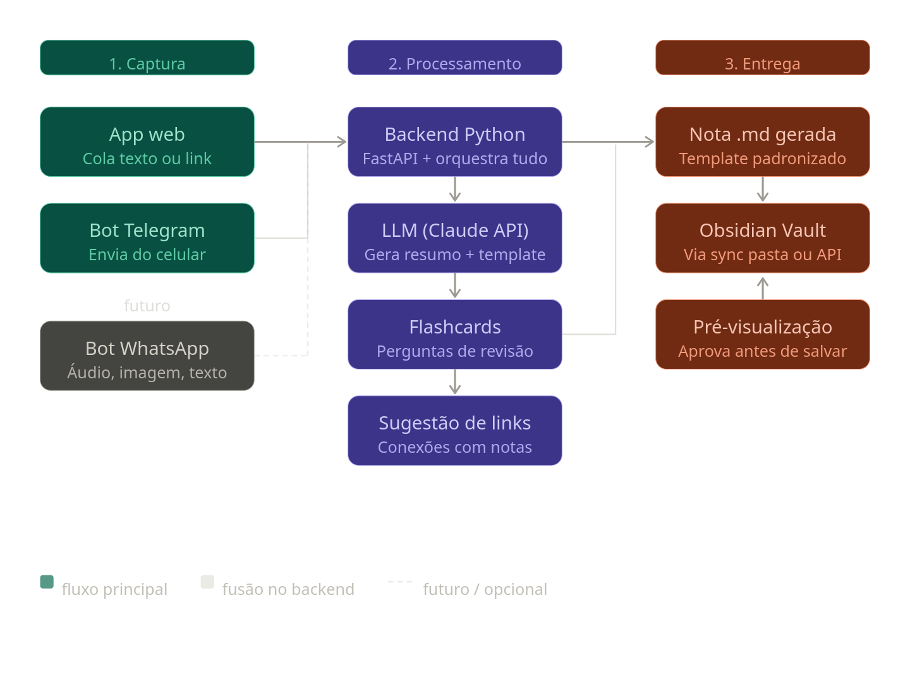

## Projeto: Second Brain Notes

Ferramenta para capturar conhecimento e salvar notas padronizadas no Obsidian.

## Stack
- Backend: Python + FastAPI
- LLM: Claude API (claude-sonnet-4-6)
- Saída: arquivos .md salvos na pasta do vault do Obsidian

## Estrutura de pastas
- /backend → API FastAPI
- /frontend → Interface web simples
- /templates → Templates de nota .md

## Convenções
- Notas sempre geradas em Markdown com frontmatter YAML
- Campos obrigatórios: título, resumo, flashcards, tags, fonte
- Salvar notas em: ~/Documents/Obsidian/Vault/Inbox/

## Arquitetura do projeto
